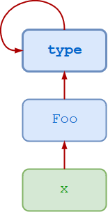

[Metaclasses] are deeper magic than 99% of users should ever worry about. If you wonder
whether you need them, you don’t (the people who actually need them know with cer‐
tainty that they need them, and don’t need an explanation about why).1
— Tim Peters


在 Python 中，所有东西都是一个对象。类也是对象。因此，一个类必须有一个类型。一个类的类型是什么呢？
```python
>>> class Foo:
...     pass
...
>>> x = Foo()

>>> type(x)
<class '__main__.Foo'>

>>> type(Foo)
<class 'type'>
```

> 一般来说，任何新式类的类型都是type()
```python
>>> for t in int, float, dict, list, tuple:
...     print(type(t))
```

> type自己也是自己创建的
```python
>>> type(type)
<class 'type'>
```
type 是一个元类，类是它的实例。就像一个普通的对象是一个类的实例一样，Python 中的任何新式类，也就是 Python 3 中的任何类，都是 type 元类的一个实例。
所谓元类，就是所有对象的祖先。

在上面的例子中。
- x是Foo类的一个实例。
- Foo是type元类的一个实例。
- type也是type元类的一个实例，所以它是自己的一个实例。



# 动态创建类
Type传入一个参数时候是返回数据类型
传入三个参数可以动态创建类

- <name> 指定了类的名称。这将成为该类的 __name__ 属性。
- <bases> 指定类所继承的基类的一个元组。这将成为该类的 __bases__ 属性。
- <dct>指定了一个包含类主体定义的命名空间字典。这将成为该类的 __dict__ 属性。

查看example1

# 创建用户自定义类
```python

class Foo:
    pass
```
表达式Foo()创建了一个Foo类的新实例。当解释器遇到Foo()时，会发生以下情况。
Foo 的父类的 `__call__()` 方法被调用。因为 Foo 是一个标准的新式类，它的父类是 type 元类，所以 type 的 `__call__()` 方法被调用。

这个 `__call__()` 方法反过来又调用了以下内容。
```python
__new__()
__init__()
```
如果 Foo 没有定义 __new__() 和 __init__() ，默认的方法将从 Foo 的祖先那里继承过来。但是如果 Foo 定义了这些方法，它们就会覆盖那些来自祖先的方法，这就允许在实例化 Foo 时进行自定义行为。

在下面，一个叫做 new() 的自定义方法被定义并被指定为 Foo 的 __new__() 方法。
```python
def new(cls):
...     x = object.__new__(cls)
...     x.attr = 100
...     return x
...
>>> Foo.__new__ = new

>>> f = Foo()
>>> f.attr
100

>>> g = Foo()
>>> g.attr
100
```

# 参考资料
https://realpython.com/python-metaclasses/#type-and-class
