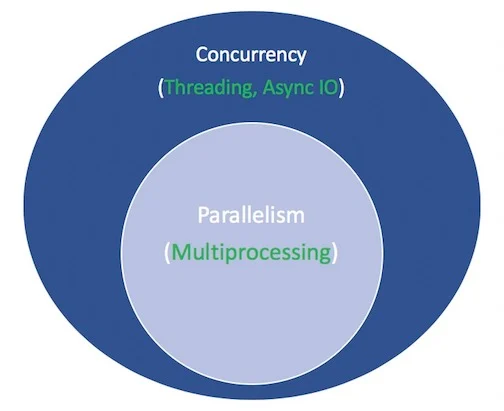

# 概念

与其久经考验的表亲--多处理和线程--相比，异步IO的知名度要低一些。本节将让你更全面地了解什么是异步IO，以及它是如何融入周围环境的。
Coroutines是计算机程序组件，它概括了非抢占式多任务的子程序，允许在某些位置暂停和恢复执行的多个入口点。Coroutines非常适用于实现熟悉的程序组件，如合作任务、异常、事件循环、迭代器、无限列表和管道。

## 异步IO法适合在哪里使用？

并发和并行是很广泛的主题，不容易涉足。虽然本文侧重于异步IO及其在Python中的实现，但还是值得花点时间将异步IO与它的同类产品进行比较，以便了解异步IO如何融入更大的、有时令人头晕的难题中。

- 并行性包括在同一时间执行多个操作。多处理是实现并行的一种手段，它需要将任务分散到计算机的中央处理单元（CPU，或核心）。多处理非常适合于由CPU约束的任务：严格约束的循环和数学计算通常属于这一类。

- 并发是一个比平行性稍宽的术语。它表明，多个任务有能力以重叠的方式运行。(有一种说法是，并发性并不意味着并行性）。

- 线程是一种并发执行模型，多个线程轮流执行任务。一个进程可以包含多个线程。由于它的 GIL，Python 与线程有着复杂的关系，但这已经超出了本文的范围。

关于线程，重要的是要知道它更适合于IO绑定的任务。与CPU绑定的任务的特点是计算机的核心从开始到结束不断地努力工作，而与IO绑定的工作则是以大量等待输入/输出完成为主导。

概括上述内容，并发性包括多处理（适合CPU绑定的任务）和线程（适合IO绑定的任务）。多处理是并行的一种形式，而并行是并发的一种特殊类型（子集）。Python 标准库通过它的多处理、线程和 concurrent.futures
包为这两种类型提供了长期的支持。

现在是时候给这个组合带来一个新成员了。在过去的几年里，一种独立的设计已经被更全面地内置到CPython中：异步IO，通过标准库的asyncio包和新的async和await语言关键字来实现。要清楚的是，async
IO并不是一个新发明的概念，它已经存在或正在被构建到其他语言和运行时环境中，比如Go、C#或Scala。

asyncio包被Python文档标榜为编写并发代码的库。然而，async IO并不是线程，也不是多进程。它不是建立在这两者之上的。

事实上，async IO 是一种单线程、单进程的设计：它使用合作式多任务，这个术语你将在本教程的最后充实它。有人说，尽管在单个进程中使用单线程，但async
IO给人一种并发的感觉。Coroutines（异步IO的一个核心特征）可以被安排为并发，但它们本身并不是并发的。

重申一下，async IO是一种并发编程的风格，但它不是并行主义。它与线程的关系比与多处理的关系更密切，但与这两者都有很大的区别，是并发性技巧袋中的一个独立成员。

这还剩下一个术语。异步的东西是什么意思？这不是一个严格的定义，但对于我们这里的目的，我可以想到两个属性。

异步程序能够在等待最终结果时 "暂停"，并让其他程序在此期间运行。 异步代码，通过上述机制，促进了并发执行。换句话说，异步代码给人以并发的外观和感觉。
这里有一张图，把这一切放在一起。白色的术语代表概念，绿色的术语代表它们被实现或影响的方式。


# 异步IO

非同步IO起初可能看起来有悖常理，自相矛盾。促进并发代码的东西怎么会使用一个线程和一个CPU核心呢? Grinberg在2017年PyCon演讲中的一个例子，它很好地解释了一切。

国际象棋大师Judit Polgár举办了一个国际象棋展览，她与多名业余棋手对弈。她有两种进行展示的方式：同步和异步。

假设。

24个对手 朱迪在5秒内走完每一步棋 对手每走一步需要55秒 游戏平均30步对局（共60步）。 同步版本。朱迪特每次下一盘棋，决不是同时下两盘，直到游戏结束。每盘棋需要（55+5）*30==1800秒，即30分钟。整个展览需要24*
30==720分钟，或12小时。

异步版本。朱迪特从一个桌子移动到另一个桌子，在每个桌子上走一步。她离开桌子，让对手在等待时间内走下一步棋。在所有24个游戏上走一步，朱迪需要24*5==120秒，即2分钟。整个展览现在被削减到120*30==3600秒，或仅仅1小时。(
资料来源)

只有一个朱迪特-波尔加尔，她只有两只手，每次只自己走一步。但异步游戏将展览时间从12小时减少到1小时。因此，合作式多任务是一种花哨的说法，即程序的事件循环（后面会详细介绍）与多个任务进行沟通，让每个任务在最佳时间轮流运行。

异步输入法将函数阻塞的漫长等待期拿出来，让其他函数在这段停顿时间内运行。(一个阻塞的函数从它开始运行到它返回时，有效地禁止了其他函数的运行。)

# 异步IO并不简单

我听人说过，"能用异步IO就用异步IO，必须用线程时就用线程"。事实是，构建持久的多线程代码是很难的，而且容易出错。异步IO避免了一些潜在的障碍，否则你可能会在线程设计中遇到这些障碍。

但这并不是说Python中的异步IO很容易。请注意：当你在表层以下冒险时，异步编程也是很困难的!
Python的异步模型是围绕着回调、事件、传输、协议和未来等概念建立的--仅仅是这些术语就会让人感到害怕。事实上，它的API一直在不断地变化，这也让它变得更加容易。

幸运的是，asyncio已经成熟到一个地步，它的大部分功能都不再是临时性的，同时它的文档也得到了巨大的修改，一些关于这个主题的高质量资源也开始出现了。

# async/await语法和原生协程

> 小心你在互联网上读到的东西。从 Python 3.4 到 Python 3.7，Python 的异步 IO API 发展得很快。一些旧的模式不再使用，一些起初不允许的东西现在通过新的引入被允许了。

非同步 IO 的核心是
coroutines。coroutine是Python生成器函数的一个专门版本。让我们从一个基线定义开始，然后随着你在这里的进展而建立：一个coroutine是一个可以在到达返回之前暂停执行的函数，它可以间接地将控制权传递给另一个coroutine一段时间。

稍后，你将深入研究传统的生成器究竟是如何被重新利用到coroutine中的。现在，了解coroutine如何工作的最简单方法是开始制作一些。

让我们采取身临其境的方式，写一些异步IO代码。这个简短的程序是异步IO的Hello World，但对说明其核心功能有很大帮助。

> countasy.py

# 异步IO的规则

在这一点上，对async、await以及它们所创建的coroutine函数进行更正式的定义是必要的。这一节有点密集，但掌握async/await是很重要的，所以如果你需要的话，请回来看看。

语法 `async def` 介绍了一个本地的 coroutine 或异步生成器。async with和async for表达式也是有效的，你将在后面看到它们。

关键字 await 将函数控制权传回给事件循环。(它暂停周围 coroutine 的执行。) 如果 Python 在 g() 的范围内遇到一个 await f() 表达式，这就是 await 告诉事件循环的方式："暂停 g()
的执行，直到我正在等待的东西--f() 的结果--被返回。同时，去让别的东西运行"。

在代码中，第二个要点看起来大致是这样的。

```python
async def g():
    # Pause here and come back to g() when f() is ready
    r = await f()
    return r
```

还有一套严格的规则，围绕着何时和如何使用async/await。无论你是在学习语法还是已经接触过使用async/await，这些规则都很方便。

- 你用async def引入的一个函数是一个coroutine。它可以使用await、return或yield，但所有这些都是可选的。声明async def noop(): pass是有效的。

    - 使用await和/或return创建一个coroutine函数。要调用一个循环函数，你必须等待它以获得其结果。

    - 在异步def块中使用yield是不太常见的（最近才合法）。这将创建一个异步生成器，你用async for来迭代它。暂时忘掉异步生成器，集中精力学习coroutine函数的语法，它使用 await 和/或 return。

    - 任何用async def定义的东西都不能使用yield from，这将引发SyntaxError。

- 就像在def函数之外使用yield是一个语法错误一样，在async def coroutine之外使用await也是一个语法错误。你只能在coroutine的主体中使用await。

```python

async def f(x):
    y = await z(x)  # OK - `await` and `return` allowed in coroutines
    return y


async def g(x):
    yield x  # OK - this is an async generator


async def m(x):
    yield from gen(x)  # No - SyntaxError


def m(x):
    y = await z(x)  # Still no - SyntaxError (no `async def` here)
    return y
```

最后，当你使用 await f() 时，要求 f() 是一个可等待的对象。嗯，这不是很有帮助，不是吗？现在，只要知道一个可等待的对象是

- (1) 另一个 coroutine 或
- (2) 一个定义了返回迭代器的 .__await__() dunder 方法的对象。如果你正在写一个程序，对于绝大多数的目的，你应该只需要担心情况1。

这给我们带来了一个你可能会看到的技术上的区别：将一个函数标记为coroutine的老方法是用@asyncio.coroutine来装饰一个正常的def函数。其结果是一个基于生成器的coroutine。自从 async/await 语法在
Python 3.5 中出现后，这种结构已经过时了。

这两个 coroutine 基本上是等价的 (都是可等待的)，但第一个是基于生成器的，而第二个是原生 coroutine。

```python

import asyncio


@asyncio.coroutine
def py34_coro():
    """Generator-based coroutine, older syntax"""
    yield from stuff()


async def py35_coro():
    """Native coroutine, modern syntax"""
    await stuff()
```

下面是一个关于异步IO如何减少等待时间的例子：给定一个循环程序makerandom()，它不断产生范围为[0, 10]
的随机整数，直到其中一个超过阈值，你想让这个循环程序的多个调用不需要等待对方连续完成。你大体上可以沿用上面两个脚本的模式，只是稍作改动。
> range.py

# 异步IO设计模式

异步IO有它自己的一套可能的脚本设计，你将在这一节中得到介绍。

## 链式循环程序

Coroutines的一个关键特征是它们可以被串联起来。(记住，一个coroutine对象是可等待的，所以另一个coroutine对象可以等待它）。 这允许你将程序分解成更小的、可管理的、可回收的coroutine 程序。

## 使用队列

使用队列 asyncio包提供了队列类，其设计类似于队列模块的类。在我们到目前为止的例子中，我们还没有真正需要一个队列结构。在 chained.py 中，每个任务（future）都是由一组 coroutines 组成的，这些
coroutines 明确地互相等待，并在每条链上传递一个输入。

有一个替代的结构，也可以与异步IO一起工作：一些生产者，它们之间没有关联，向一个队列添加项目。每个生产者可以在交错的、随机的、未宣布的时间向队列中添加多个项目。一组消费者从队列中提取物品，因为它们出现了，贪婪地，不等待任何其他信号。

在这种设计中，没有任何一个消费者与生产者之间的连锁关系。消费者不知道生产者的数量，甚至不会提前知道将被添加到队列中的项目的累积数量。

单个生产者或消费者分别需要花费不同的时间来放置和提取队列中的项目。队列作为一个吞吐量，可以与生产者和消费者沟通，而不需要他们直接对话。

注意：虽然由于queue.Queue()的线程安全，队列经常被用于线程程序中，但当涉及到异步IO时，你不需要需要关注线程安全问题.

队列的一个用例（如这里的情况）是队列作为生产者和消费者的发送器，而这些生产者和消费者并不是直接连锁或相互关联的。

这个程序的同步版本看起来非常糟糕：一组阻塞的生产者连续向队列中添加项目，一次一个生产者。只有在所有生产者都完成后，才能由一个消费者逐项处理队列。这种设计有很大的延迟性。项目可能会在队列中闲置，而不是立即被拾起和处理。

下面是一个异步的版本，asyncq.py，。这个工作流程的挑战在于，需要有一个信号给消费者，说明生产已经完成。否则，await q.get()将无限期地挂起，因为队列将被完全处理，但消费者不会有任何生产完成的想法。

理清了main()的思路：关键是等待q.join()，它一直阻塞到队列中的所有项目都被接收和处理，然后取消消费者任务，否则这些任务会挂起，无休止地等待更多队列项目出现。）

# 参考文档

- https://realpython.com/async-io-python/