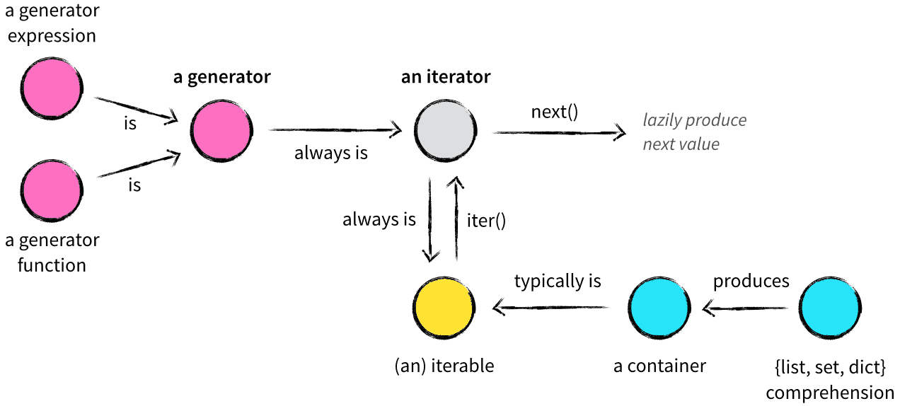

# 生成器，迭代器，可迭代对象关系



- 生成器表达式是生成器
- 生成器方法是成成器
- 生成器是迭代器一种
- 迭代器是可迭代的对象
- 可迭代对象通过 iter()函数变成迭代器
- 迭代器通过 next()方法实现懒加载
- 容器是可迭代对象
- list，set，dict 是容器

## 容器

- 容器是一种把多个元素组织在一起的高级数据结构，容器中的元素可以逐个迭代获取，可以用 in，not in 关键字判断元素是否包含在容器中。 容器实现了`__contains__`方法

```python
class A:

    def __init__(self):
        self.items = [1, 2]

    def __contains__(self, item):
        return item in self.items


a = A()
print(1 in a)  # True
print(2 in a)  # True
print(3 in a)  # False
```

- 通常这类数据结构把所有的元素存储在内存中（也有一些特例，并不是所有的元素都放在内存，比如迭代器和生成器对象）。
- 常用的 string、set、list、tuple、dict 都属于容器对象。

## 迭代器

- 迭代器是一个带状态的对象，它能在你调用 next()方法时返回容器中的下一个值，任何实现了**iter**()和**next**() 都是迭代器
- 迭代器与容器类数据（比如列表）的区别在于，构建迭代器的时候，不像列表把所有元素一次性加载到内存，而是以一种延迟计算（lazy evaluation）方式返回元素
- 一个对象要想使用 for 的方式迭代出容器内的所有数据，这就需要这个类实现「迭代器协议」。本质上 for 循环就是不断地调用迭代器的 next()方法,并且处理了 StopIteration 异常
- 迭代器不能做成员操作，也是说没有`__contains__`属性

### 迭代器协议

> 一个类如果实现了「迭代器协议」，就可以称之为「迭代器」。 在 Python 中，实现迭代器协议就是实现以下 2 个方法：

- `__iter__`：这个方法返回对象本身，即 self
- `__next__`：这个方法每次返回迭代的值，在没有可迭代元素时，抛出 StopIteration 异常
- 可迭代对象通过 iter()方法转化成迭代器，可以看成 iter()实质上给可迭代对象加上了 next 方法

查看例子： iterator.py

## 可迭代对象

- `__iter__` 方法返回一个迭代器，那么这个对象就是「可迭代对象」
- 可迭代对象没有实现**next** 方法，这是本质上区别

```python
class A:
    def __init__(self, n):
        self.idx = 0
        self.n = n

    def __iter__(self):
        print('__iter__')
        return self

    # 有无__next__方法决定了是迭代器还是可迭代对象
    def __next__(self):
        if self.idx < self.n:
            val = self.idx
            self.idx += 1
            return val
        else:
            raise StopIteration()
```

通过查看内建数据类型可以得到这个结论

```python
In[8]: a = list()

In[9]: hasattr(a, "__iter__")
Out[9]: True

In[10]: hasattr(a, "__next__")
Out[10]: False

# 通过iter()函数把list a转化之后可以得到迭代器
In[11]: iterator_a = iter(a)

In[12]: hasattr(iterator_a, "__next__")
Out[12]: True

In[13]: hasattr(iterator_a, "__iter__")
Out[13]: True
```

# Generator（生成器）

普通函数用 return 返回一个值,还有一种函数用 yield 返回值，这种函数叫生成器函数。函数被调用时会返回一个生成器对象。生成器其实是一种特殊的迭代器，不过这种迭代器更加优雅，它不需要像普通迭代器一样实现**iter**()和**
next**()方法了，只需要一个 yield 关键字。生成器一定是迭代器（反之不成立）。

- yield 返回一个对象
- 生成器是特殊的迭代器
- 生成器两种实现 yield 关键字和生成器表达式
- 生成器对象只有碰到 next()方法才会真正执行，使用 for 关键字其实也是隐式去触发 next()方法

## 生成器为什么只能被消耗一次？

其实这个和迭代器性质是一样的，每次只保存当前状态（或者说值），前一次状态已经被释放掉了，假设生成器生成一组连续数，这个过程是不可逆的。

## 查看代码样例

generator_example.py

# 总结

- 可迭代对象（Iterable）是实现了**iter**()方法的对象，通过调用 iter()方法可以获得一个迭代器（Iterator）。
- 迭代器（Iterator）是实现了**iter**()方法和**next()**方法的对象。
- for...in...的迭代实际是将可迭代对象转换成迭代器，再重复调用 next()方法实现的。
- 生成器（Generator）是一个特殊的迭代器，它的实现更简单优雅。
- yield 是生成器实现**next**()方法的关键。它作为生成器执行的暂停恢复点，可以对 yield 表达式进行赋值，也可以将 yield 表达式的值返回。

# 参考资料

- https://zhuanlan.zhihu.com/p/341439647
- https://cloud.tencent.com/developer/article/1805426
