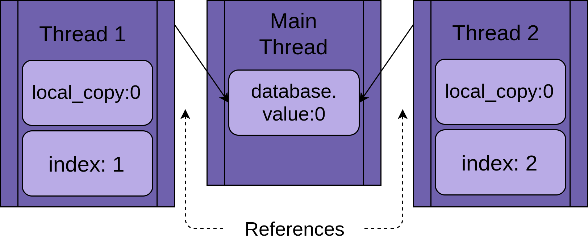
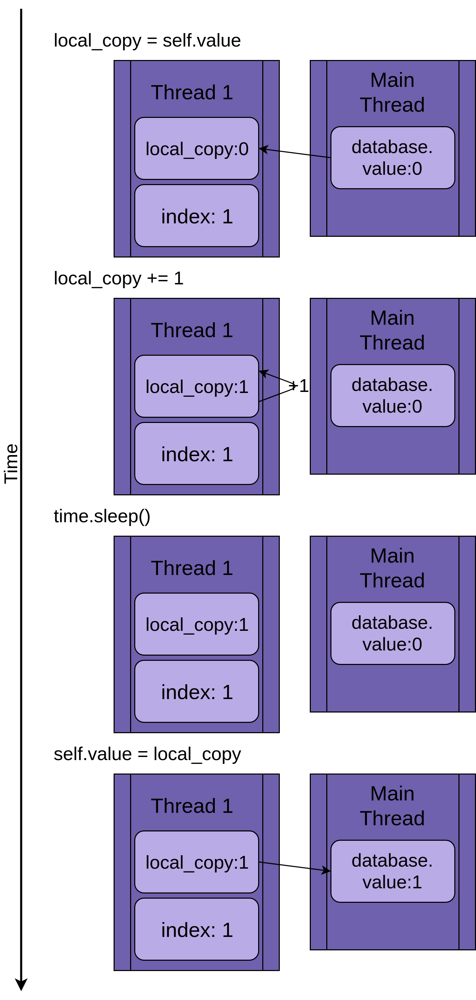
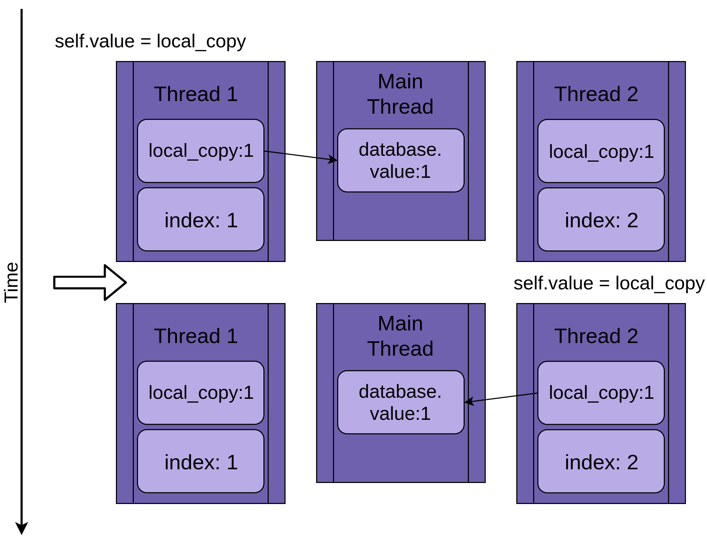

# 一、进程

## 进程的概念

## 1.进程是一个实体。每个进程都有自己的地址空间(CPU分配)。实体空间包括三部分：

* 文本区域：存储处理器执行的代码。
* 数据区域：存储变量或进程执行期间使用的动态分配的内存。
* 堆栈：进程执行时调用的指令和本地变量。

## 2.进程是一个“执行中的程序”。

程序是指令与数据的有序集合,程序本身是没有生命的,只有CPU赋予程序生命时(CPU执行程序),它才能成为一个活动的实体,称为“进程”。 概括来说，进程就是一个具有独立功能的程序在某个数据集上的一次运行活动。

## 进程的特点

* 动态性：进程是程序的一次执行过程，动态产生，动态消亡。
* 独立性：进程是一个能独立运行的基本单元。是系统分配资源与调度的基本单元。
* 并发性：任何进程都可以与其他进程并发执行。

# 二、并发与并行

- 并发：在操作系统中，某一时间段，几个程序在同一个CPU上运行，但在任意一个时间点上，只有一个程序在CPU上运行。

当有多个线程时，如果系统只有一个CPU，那么CPU不可能真正同时进行多个线程，CPU的运行时间会被划分成若干个时间段，每个时间段分配给各个线程去执行，一个时间段里某个线程运行时，其他线程处于挂起状态，这就是并发。并发解决了程序排队等待的问题，如果一个程序发生阻塞，其他程序仍然可以正常执行。

- 并行：当操作系统有多个CPU时，一个CPU处理A线程，另一个CPU处理B线程，两个线程互相不抢占CPU资源，可以同时进行，这种方式成为并行。

## 区别

并发只是在宏观上给人感觉有多个程序在同时运行，但在实际的单CPU系统中，每一时刻只有一个程序在运行，微观上这些程序是分时交替执行。
在多CPU系统中，将这些并发执行的程序分配到不同的CPU上处理，每个CPU用来处理一个程序，这样多个程序便可以实现同时执行。

# 三、线程

## 3.1、线程的引入

60年代，操作系统中拥有资源并独立运行的基本单位是进程，进程是资源的拥有者，进程的创建、撤销、切换花销太大。多CPU处理出现，可以满足多个单位同时运行，但是多个进程并行花销太大。80年代，出现了轻量级的，能够独立运行的基本单位，线程。

## 3.2、线程的概念

线程是进程中的一个实体，是被系统独立调度和分派的基本单位。 线程的实体包括程序，数据，TCB（Thread Control Block）。TCB包括：

- 线程状态
- 线程不运行时，被保存的现场资源
- 一组执行堆栈
- 每个线程的局部变量
- 访问统一进程中的资源

## 线程自己不拥有系统资源，只拥有一点运行中必不可少的资源。

## 同一进程中的多个线程并发执行，这些线程共享进程所拥有的资源。

# 3.3、进程与线程的区别

- 进程是CPU资源分配的基本单位，线程是独立运行和独立调度的基本单位（CPU上真正运行的是线程）。
- 进程拥有自己的资源空间，一个进程包含若干个线程，线程与CPU资源分配无关，多个线程共享同一进程内的资源。
- 线程的调度与切换比进程快很多。

# 四、协程

- 协程是一种比线程更加轻量级的存在，最重要的是，协程不被操作系统内核管理，协程是完全由程序控制的。

- 运行效率极高，协程的切换完全由程序控制，不像线程切换需要花费操作系统的开销,线程数量越多，协程的优势就越明显。

- 协程不需要多线程的锁机制，因为只有一个线程，不存在变量冲突。

# 全局解释器锁（GIL）

Python的多线程，只有用于I/O密集型程序时效率才会有明显的提高。

原因如下：

> Python代码的执行是由Python虚拟机进行控制。它在主循环中同时只能有一个控制线程在执行，意思就是Python解释器中可以运行多个线程，但是在执行的只有一个线程，其他的处于等待状态。

## Threading 模块

Python 标准库提供了线程，它包含了你将在本文中看到的大多数原始方法。线程，在这个模块中，很好地封装了线程，提供了一个简洁的接口来处理它们。

## Threading.thread 参数

- 这个构造函数应该总是用关键字参数来调用。
- *group：* None；留给将来实现线程组时扩展的 类实现时保留。

- *target:* 是被run()方法调用的可调用对象。默认为None，意味着没有任何东西被调用。

- *name:* 是线程的名称。默认情况下，一个独特的名称被构造为Thread-N 的形式，其中N是一个小的十进制数字。

- *args:* 是目标调用函数的参数元组。默认为()。

- *kwargs:* 是目标调用的关键字参数的字典。调用的关键字参数字典。默认为{}。

- 如果一个子类重写了构造函数，它必须确保调用 基类构造函数 `(Thread.__init__())`，然后再对线程做任何事情。对线程做任何事情之前，必须确保调用基类构造函数`(Thread.__init__())`。

```查看例子
single_thread.py
```

## 守护进程

- 在计算机世界里中，守护进程是一个在后台运行的进程。
- Python线程对守护进程有一个更具体的含义。一个守护线程会在程序退出时立即关闭。思考这些定义的一种方式是把守护线程看作是在后台运行的线程，而不用担心关闭它。
- 如果一个程序正在运行不是守护进程的线程，那么该程序将等待这些线程完成后再终止。然而，作为守护进程的线程，在程序退出时，无论它们在哪里都会被杀死。

看看例子

```
single_thread_logging_daemon.py
```

## 使用多线程

查看多线程例子

```
multiple_threads_logging.py
```

## 使用ThreadPoolExecutor

```multiple_threads_poolexecutor_logging.py```

# 竞争条件

在你继续研究隐藏在Python线程中的其他一些特性之前，让我们先看下你在编写线程程序时遇到的一个更困难的问题：竞争条件。


> 当两个或更多的线程访问一个共享的数据或资源时，就会发生竞争条件。

在这个例子中，你将创建一个每次都会发生的竞争条件，但要注意，大多数竞争条件并不那么明显。通常，它们只是很少发生，而且会产生令人困惑的结果。正如你想的那样，这使得它们相当难以调试。 在这个例子中，竞争条件在每次执行中都会发生。 
查看例子
```fake_database_race_condition.py```

## 一个线程

- 当你告诉你的ThreadPoolExecutor运行每个线程时，你告诉它要运行哪个函数以及要传递给它什么参数：executor.submit(database.update, index)。

- 这样做的结果是，池中的每个线程都将调用数据库.update(index)。注意，数据库是对 __main__ 中创建的一个 FakeDatabase 对象的引用。在该对象上调用.update()会调用该对象的一个实例方法。

- 每个线程都会有一个对同一个FakeDatabase对象的引用，即数据库。每个线程也将有一个唯一的值，即索引，以使记录语句更容易被识别。



- 当线程开始运行.update()时，它有自己版本的local。在.update()
  的情况下，这就是local_copy。这是一件好事。否则，两个运行同一函数的线程总是会互相混淆。这意味着，所有对函数有作用域（或局部）的变量都是线程安全的。

- 现在你可以开始看一下，如果你用一个线程和一个对.update()的调用来运行上面的程序会发生什么。

- 下面的图片显示了在只有一个线程运行的情况下执行.update()的情况。语句显示在左边，后面的图显示了线程的local_copy和共享数据库.value中的值。
  

## 两个线程


这两个线程对一个共享对象进行交错访问，互相覆盖对方的结果。当一个线程在另一个线程访问完毕之前释放内存或关闭文件句柄时，也会出现类似的竞赛条件。

# 使用锁

- 锁是一个对象，它的作用就像一个大厅通行证。每次只有一个线程可以拥有这个锁。任何其他想要获得锁的线程都必须等待，直到锁的主人放弃它。

- 做到这一点的基本函数是.acquisition()和.release()。一个线程将调用my_lock.acquisition()
  来获得锁。如果锁已经被持有，调用线程将等待它被释放。这里有一个重要的问题。如果一个线程得到了锁，但却没有把它交出来，你的程序就会死锁

- 幸运的是，Python 的锁也可以作为一个上下文管理器来操作，所以你可以在 with 语句中使用它，而且当 with 块因任何原因退出时，它将自动释放。

查看代码

```
fake_database_fix_race.py

```

# 死锁

```python
import threading

l = threading.Lock()
print("before first acquire")
l.acquire()
print("before second acquire")
l.acquire()
print("acquired lock twice")

```

当程序第二次调用l.acquisition()时，它会挂起，等待锁被释放。在这个例子中，你可以通过删除第二个调用来解决死锁问题，但死锁通常是由两个微妙的事情之一发生的。

- 一个实现错误，即锁没有被正确释放
- 一个设计问题，即一个实用函数需要被可能拥有或不拥有该锁的函数所调用。

第一种情况有时会发生，但使用Lock作为上下文管理器会大大减少这种情况。我们建议在编写代码时尽可能利用上下文管理器，因为它们有助于避免出现异常跳过.release()调用的情况。

在一些语言中，这个设计问题可能有点棘手。值得庆幸的是，Python 线程有第二个对象，叫做 RLock，就是为这种情况设计的。它允许一个线程在调用 .release() 之前多次 .acquisition() 一个
RLock。该线程仍然需要调用.release()，其次数与调用.acquisition()的次数相同，但无论如何它应该这样做。

Lock和RLock是线程编程中用于防止竞赛条件的两个基本工具。还有其他一些以不同方式工作的工具。

# 消费者生产者线程

生产者-消费者问题是一个标准的计算机科学问题，用于研究线程或进程同步问题。你将看一下它的一个变体，以获得一些关于 Python 线程模块提供的基本方法。

在这个例子中，你将想象一个需要从网络中读取消息并将其写入磁盘的程序。这个程序并不是在它想要的时候请求消息。它必须倾听并在消息进来时接受它们。这些消息不会以有规律的速度进来，而是以突发的方式进来。程序的这一部分被称为生产者。

在另一边，一旦你有了消息，你需要把它写到数据库中。数据库的访问速度很慢，但快到足以跟上消息的平均速度。当有大量消息涌入时候，它的速度不足以跟上。这一部分是消费者。

在生产者和消费者之间，你将创建一个管道（Pipeline），这部分将随着你对不同同步对象的学习而改变。

这就是基本的问题模型，也是消费者-生产者模型的一个例子。让我们看看一个使用Lock的解决方案。

## 使用lock解决

查看代码例子

```
producer_consumer_locker.py
```

## 使用队列queue(更优雅解决方案)

如果你希望能够在管道中一次处理多个值，你就需要一个管道的数据结构，允许数量随着生产者的数据备份而增加和减少。

Python 的标准库有一个队列模块，它又有一个 Queue 类。让我们改变管道来使用一个队列，而不仅仅是一个由锁保护的变量。

查看代码样子
```
producer_consumer_queue.py
```

# 参考

- https://zhuanlan.zhihu.com/p/43373955
- https://zhuanlan.zhihu.com/p/91601448
- https://realpython.com/intro-to-python-threading/