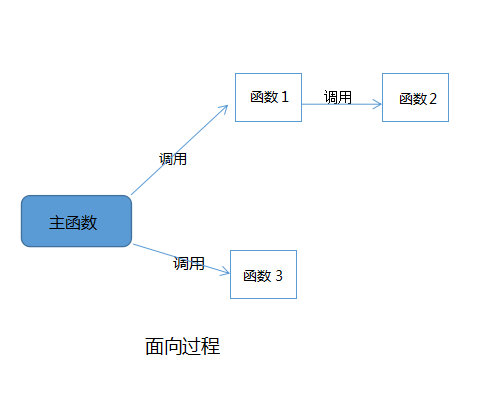
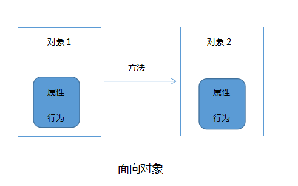

# 面向对象

# 面向对象编程基本概念

面向对象设计（Object-Oriented Programming， 缩写为 OOP）是一种范式，其基本理念是将数据块及与数据相关的
行为封装成为特殊的、名为对象的实体，同时对象实体的生成工作则是基于程序员给出的一系列“蓝图”，这些“蓝图”就是类。

面向对象设计几个基本特征

- 抽象，多态，封装，继承

## 抽象对象

### 和面向过程区别

- 面向过程就是分析出解决问题所需要的步骤，然后用函数把这些步骤一步一步实现，使用的时候一个一个依次调用就可以了；
- 面向对象是把构成问题事务分解成各个对象，建立对象的目的不是为了完成一个步骤，而是为了描叙某个事物在整个解决问题的步骤中的行为。
  
  可以用一个具体的例子理解面向过程与面向对象，例如五子棋，面向过程的设计思路就是首先分析问题的步骤：
  用函数实现上面一个一个的步骤，然后在下五子棋的主函数里依次调用上面的函数（不同的编程语言有不同的调用方法）：

```
下五子棋{

开始游戏（）；

黑子先走（）；

绘制画面（）；

判断输赢（）；

轮到白子（）；

绘制画面（）；

判断输赢（）；

返回到 黑子先走（）；

输出最后结果；

}
```

- 面相对想实现。

```
 在下五子棋的例子中，用面向对象的方法来解决的话，首先将整个五子棋游戏分为三个对象:

（1）黑白双方，这两方的行为是一样的。

（2）棋盘系统，负责绘制画面

（3）规则系统，负责判定犯规、输赢等。

然后赋予每个对象一些属性和行为：

（4）第一类对象（黑白双方）负责接受用户输入，并告知第二类对象（棋盘系统）棋子布局的变化，棋盘系统接收到了棋子的变化，并负责在屏幕上面显示出这种变化，同时利用第三类对象（规则系统）来对棋局进行判定。

```

    

### 程序是系统的仿真

### 一切皆为对象

### 程序是对象的集合，他们通过发送消息来进行通信

### 对象是类的实例

### 每个对象提供服务

### 服务具体实现

查看代码样例 tortoise.py

# 面向对象中常用术语：

- 类：可以理解是一个模板，通过它可以创建出无数个具体实例。
- 对象：实例化后的类称为对象。
- 属性：类中的所有变量和方法称为属性。
- 方法：类中的所有函数通常称为方法。

## 类的定义

Python 中定义一个类使用 class 关键字实现，其基本语法格式如下：

```
class 类名：
    多个（≥0）类属性...
    多个（≥0）类方法...
```

例如，某游戏中设计一个乌龟的角色，应该如何来实现呢？使用面向对象的思想会更简单，可以分为如下两个方面进行描述：

- 从表面特征来描述，例如，绿色的、有 4 条腿、重 10 kg、有外壳等等。
- 从所具有的的行为来描述，例如，它会爬、会吃东西、会睡觉、会将头和四肢缩到壳里，等等。
  查看代码样例 tortoise.py

## **init**构造方法

- 作用-初始化参数
- 实例化类时候隐式调用（自动调用）
- 通过重写父类**init**实现自己的 init
- 没有返回值

查看 init 例子

## 实例化

### 调用实例化类并调用

其语法格式：

```
类名(参数)
```

#### 对象的使用

实例化后的类对象可以执行以下操作：

- 访问或修改类对象具有的实例变量，也可以添加新的实例变量或者删除已有的实例变量；
- 调用类对象的方法，包括调用现有的方法，以及给类对象动态添加方法。
- 类对象访问变量或方法

使用已创建好的类对象访问类中实例变量的语法格式如下：

```
类对象名.变量名
```

使用类对象调用类中方法的语法格式如下：

```
对象名.方法名(参数)
```

支持动态添加对象属性
查看例子 instance_example.py

## 动态创建类或者方法

### self 概念

- self 表示实例，而不是类
- self 可以被重命名
- 类里面方法默认被绑定在实例上面，而不是类。如果要设定成类方法，需要加装饰器方法@static_method 或者@classmethod
  查看 self_example.py self_example2.py

### 使用 type 动态创建类 (了解)

动态创建 - 在程序运行时候创建
查看例子 dynamical_instance_example.py

### 给实例添加属性

- 直接添加

查看代码例子
add_method_property/static_way.py

- 使用 type 函数添加

查看代码例子 add_method_property/use_type_function.py

## 属性

- 类属性
- 实例属性
- 局部变量
- 私有属性

查看代码例子 property

## 方法

- 实例方法（默认）
- 类方法
- 静态方法

查看代码例子 method

### 类方法和静态方法区别

| class 方法             | static 方法    |
| ---------------------- | -------------- |
| cls 作为第一个参数     | 不需要确定参数 |
| 可以访问或者修改类状态 | 不能访问       |

在什么场景用 static 或者 classmethod

## 命名空间

- 命名空间基本概念
  - 内建
  - 全局
  - 局部
- 两个维度 - 时间和空间
- 为什么有命名名空间？
- 查找顺序
- 实际项目常见问题 - 方法名字，类，变量，等覆盖内建或者上层名字 - 文件名字覆盖
  查看 namespace/build_and_globals.py

- 类和实例命名空间
  namespace/instance_and_class.py

# 继承

概念：
继承机制经常用于创建和现有类功能类似的新类，又或是新类只需要在现有类基础上添加一些成员（属性和方法），但又不想直接将现有类代码复制给新类。也就是说，通过使用继承这种机制，可以轻松实现类的重复使用。

- 为什么有继承机制 ？
- 什么时候使用继承 ？
- 怎么用？

## python 继承特点

- 子类拥有父类所有属性
- 子类可以重写父类属性
- 子类可以新增属性
- 子类可以通过 super 访问父类方法

查看例子
Inherit/Employee.py

- 没有专门接口或者抽象类 - 接口类：基于同一个接口实现的类 刚好满足接口隔离原则 面向对象开发的思想 规范 - 接口类，python 原生不支持 在 python 中，并没有接口类这种东西，即便不通过专门的模块定义接口，我们也应该有一些基本的概念
  """
  Inherit/interface.py

- 支持多继承 - 多继承带来问题
  python 的类分为两种类型: 经典类(python2 的默认类)和新式类(python3 的默认类)，经典类在继承的时候采用深度优先的顺序，而新式类的继承顺序则采用广度优先(从左到右)的顺序。

查看 class_super_order.py

# 属性管理

属性管理的几种方式：

在 python 中访问、设置、删除对象属性的时候，有以下几种方式：

- 内置函数管理属性

  - buildin_method.py

- 使用内置函数 getattr()、setattr()和 delattr()

  - management_property/buildin_method.py

- 自己编写 getter()、setter()、deleter()方法

  - user-defined_set_and_get.py

- 重载**getattr**()、**setattr**()、**delattr**()运算符，这决定了 x.y 的访问、赋值方式以及 del x.y 的方式

  - reload_operator.py

- 使用**getattribute**()方法
  - 使用类名调用类属性时，不会经过**getattribute**方法，只争取实例对象对属性的调用，包括调用类属性
  - **getattribute**是属性拦截器，属性调用会传入处理，最后要有返回值，将传入属性处理后返回给调用者。
  - **getattribute** 与 **getattr** 相似，重要的区别是 **getattribute** 将拦截所有的属性查询，而不管这个属性是否存在。
  - getattribute.py

## 使用 property 协议，

它是一种特殊的描述符，把方法变成属性。如果只有@property 装饰，那么 value 是只读不可写的。因此在 property 装饰的基础上，还附赠了@x.setter 装饰器和@x.deleter 装饰器。 - 语法简洁，可读性高 - 可以直接访问实例属性，同事使用（getter 和 setters 来验证新值，避免直接修改数据 - 通过使用@property，你可以 "重用 "一个属性的名称，避免为 getters、setters 和 deleters 创建新的名称。

你可以用 @property 语法来定义属性，它更加紧凑和可读。
@property 可以被认为是定义 getters、setters 和 deleters 的 "pythonic "方式。
通过定义属性，你可以在不影响程序的情况下改变类的内部实现，因此你可以添加作为 "幕后 "中介的 getters、setters 和 deleters，以避免直接访问或修改数据。

# 描述符（decriptor）协议

python 中的描述符可以用来定义触发自动执行的代码，它像是一个对象属性操作(访问、赋值、删除)的代理类一样。前面介绍过的 property 是描述符的一种。
定义

- 描述符（descriptor）：是一个有"绑定行为"的对象属性(object attribute)，它的访问控制会被描述器协议方法重写。
- 任何定义了 **get**, **set** 或者 **delete** 任一方法的类称为描述符类，其实例对象便是一个描述符，这些方法称为描述符协议。
- 当对一个实例属性进行访问时，Python 会按 obj.**dict** → type(obj).**dict** → type(obj)的父类.**dict** 顺序进行查找，如果查找到目标属性并发现是一个描述符，Python 会调用描述符协议来改变默认的控制行为。
  描述符是 @property @classmethod @staticmethod 和 super 的底层实现机制。

## 特性

- 同时定义了 **get** 和 **set** 的描述符称为 数据描述符(data descriptor)；仅定义了 **get** 的称为 非数据描述符(non-data descriptor) 。两者区别在于：如果 obj.**dict** 中有与描述符同名的属性，若描述符是数据描述符，则优先调用描述符，若是非数据描述符，则优先使用 obj.**dict** 中属性。
- 描述符协议必须定义在类的层次上，否则无法被自动调用。

大致流程是这样的：

- 定义一个描述符类 D，其内包含一个或多个**get**()、**set**()、**delete**()方法
- 将描述符类 D 的实例对象 d 赋值给另一个要代理的类中某个属性 attr，即 attr = D()
- 之后访问、赋值、删除 attr 属性，将会自动触发描述符类中的**get**()、**set**()、**delete**()方法
  - descriptor_way.py Person_perperty_method.py

# 装饰器

# 魔术方法

# 元类

- https://realpython.com/python-metaclasses/ （查看图片）
-
